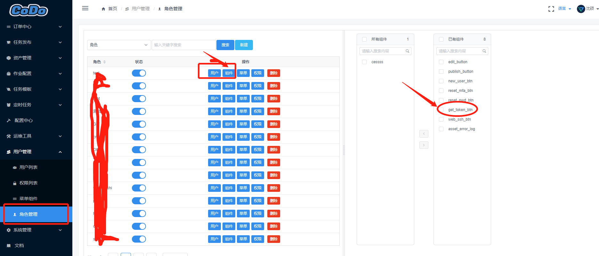

## 后端管理平台
[更新日志](https://github.com/ss1917/do_mg/releases)

[部署文档](http://docs.opendevops.cn/zh/latest/codo-admin.html)

[在线访问](http://demo.opendevops.cn/)

### 简介
&emsp;&emsp;  本应用是基于tornado框架 restful风格的API 实现后台管理，搭配使用admin-front前端([iView](https://www.iviewui.com)+ [vue](https://cn.vuejs.org/))组成的一套后台用户 权限以及系统管理的解决方案（提供登录，注册 密码修改 鉴权 用户管理 角色管理 权限管理 前端组件管理 前端路由管理 通知服务API 系统基础信息接口）
本项目为CODO开源项目提供后台支持，也可以基于此项目基础项目开发自己的站点，更多基础功能还在不断开发中，如果想要查看更新动态，你可以到[更新日志](https://github.com/ss1917/do_mg/releases)查看最新更新，如果你是新手想快速部署，你可以去[部署文档](https://github.com/ss1917/do_mg/tree/master/doc/deployment.md) 查看  
### 功能

- 登录/登出 （支持谷歌动态码/支持邮箱登录/支持LDAP登录）

- 密码修改

- 鉴权 /权限刷新

- 用户管理   用户系统基于RBAC模型的

- 角色管理  

- 权限管理 （后端路由）基于角色

- 菜单管理 （前端路由）基于角色

- 组件管理 （前端组件）基于角色

- 通知管理 （提供发送短信，发送邮件API）

- 系统配置 （后端api地址，短信配置，邮件配置，存储配置，邮箱登录等等）

- 系统日志 （从API网关获取日志，当然也可以自行从基类获取）

  

### 结构

```shell
├── doc
│   ├── data.sql
│   ├── deployment.md
│   ├── nginx_ops.conf
│   ├── requirements.txt
│   └── supervisor_ops.conf
├── docker-compose.yml
├── Dockerfile
├── __init__.py
├── libs
│   ├── base_handler.py
│   ├── __init__.py
│   ├── my_verify.py
│   └── utils.py
├── mg
│   ├── applications.py
│   ├── handlers
│   │   ├── app_mg_handler.py
│   │   ├── app_settings_handler.py
│   │   ├── components_handler.py
│   │   ├── configs_init.py
│   │   ├── functions_handler.py
│   │   ├── __init__.py
│   │   ├── login_handler.py
│   │   ├── menus_handler.py
│   │   ├── notifications_handler.py
│   │   ├── roles_handler.py
│   │   ├── users_handler.py
│   │   └── verify_handler.py
│   ├── __init__.py
│   └── subscribe.py
├── models
│   ├── admin.py
│   ├── app_config.py
│   ├── __init__.py
├── README.md
├── settings.py
└── startup.py
```


### 展示
### 用户管理

> 这部分文档主要用来介绍用户管理，它可以很精细的管理你的用户权限


#### 用户列表

用户列表：顾名思义，用来管理和展示用户的列表，记录用户的详细信息

**功能支持**

- 搜索用户
- 新建用户
- 删除用户
- 关闭用户
- 重置密码
- 重置MFA（Google Authenticator）
- 获取令牌

**展示界面**


#### 权限列表

用来详细配置管理每个接口的权限，默认不需修改。


**注意事项**

- 系统默认已经配置了所有权限和方法，管理员默认拥有`/`权限，无需修改，以免造成系统请求某功能出错


**功能说明**

- 支持多种搜索方式，如：权限名称、请求路径、请求方法、时间等
- 支持新增、编辑、关闭、删除等操作权限的管理

- 支持新增自定义权限功能，适用于开发人员编写的API接口能很方便的接入进来权限管理划分

- 一些详细的API及使用文档正在支持更新中............


#### 菜单组件

菜单组件：顾名思义，也就是导航栏所看到的功能模块（如：用户管理、系统管理）和一些功能按钮（如：编辑、删除按钮），默认无需修改


**注意事项**

- 系统默认已经配置了所有菜单功能模块及组件，无需修改此项，以免造成访问出错。


**功能介绍**

列举以下几个菜单和组件进行介绍，字面英语也可看出含义，如下：

- home：家目录
- usermanage：用户管理
- cron：定时任务
- edit_button：编辑按钮

由于代码层面不好直接使用中文，你可以选择平台语言`English`，如下图，很清晰看到每个作用。


#### 角色管理

基于[RBAC](https://baike.baidu.com/item/RBAC/1328788?fr=aladdin)角色管理访问控制权限，可以很精细/方便的管理你的用户权限


**功能介绍**

- 角色的搜索、编辑、关闭、删除
- 自定义角色名字，自定义赋权组件、菜单、权限管理

- 列表可搜索赋权设计，方便用户可视化操作


**示例介绍分为两部分，创建管理员用户赋权和创建普通用户赋权**

#### 创建普通用户示例

**新建用户**  

同上，填写信息即可，详细权限管理全部在角色管理配置

**用户赋权**


#### 创建管理员用户示例

**新增用户**

点击用户列表---新增用户，输入信息


**用户赋权**

点击角色管理---新建，输入角色信息，选择角色进行赋权


### 系统管理

> 这部分主要介绍系统配置，系统管理模块主要分为：`系统配置`和`系统日志`

#### 系统配置
> 系统配置主要介绍系统参数配置，后续后陆续支持各种核心功能配置

**系统配置**
> 这块需要配置你的API地址，部署时你API网关服务所部署的服务器地址，只有确认了API网关，各个功能模块才可以正常通信。

- API地址: 你的API网关地址，可以是IP/域名，必填项。 [API网关部署](http://docs.opendevops.cn/zh/latest/)


**邮件设置**

> 这块主要配置邮箱，配置了此邮箱信息后，后续平台内所涉及到邮件提醒都会使用此邮箱配置。

不同运营商配置可参考`FAQ`中[邮箱设置问题](http://docs.opendevops.cn/zh/latest/faq.html#)


- SMTP主题： 邮件标题
- SMTP主机： 服务器地址
- SMTP端口： 服务器端口
- SMTP账户： 邮箱账户名
- SMTP密码： 邮箱账户密码
- 如果SMTP端口是465，通常需要启用SSL
- 如果SMTP端口是587，通常需要启用TLS
- 点击测试邮件会给当前用户发送一封邮件用于测试


**短信接口**
> 这块主要配置短信接口信息，短信接口只支持阿里云`阿里大鱼`，后续平台所涉及到发短信会调用此接口

- 短信区域： `cn-hangzhou` 目前阿里官方给出必须是这个
- API名称： `Dysmsapi` 目前官方给出一般都是这个名称
- API域名：`dysmsapi.aliyuncs.com` 目前官方给出必须是这个地址
- KEY_ID： 你的IAM访问控制密钥ID
- KEY_SECRET： 你的access_secret密钥，备注：`这里需要必须有SMS的权限`
- 点击测试端口会给当前用户发送一条短信用于测试


**邮箱登陆**
> 这块主要是支持第三方邮箱登陆，当你想要使用邮箱登陆此平台时，你可以在此进行配置
比如我们企业邮箱是腾讯的,域名就是`opendevops.cn`，SMTP就是腾讯的`stmp.exmail.qq.com`,这样配置完成后我就可以使用我`yanghongfei@opendevops.cn`邮箱+密码登陆此平台了。


- 邮箱SMTP： 这里输入你邮箱服务商的SMTP地址
- 邮箱域名：这里是你的邮箱后缀名字


**存储配置**
-> 这块主要是配置Bucket信息，目前只支持阿里云的OSS，这里目前主要用于将跳板日志审计的内容存放到OSS目录里面，若不配置此项则存数据库（可能会很大)
- 区域Region：阿里云的可用区域，如：`cn-hangzhou`
- 存储桶名称: Bucket名称
- SecretID: 密钥ID，需要有OSS权限
- Secret Key： 密钥Key，需要有OSS权限


#### 系统日志
> 这里主要记录的本系统平台的所有请求日志，如：GET/POST/DELETE/PUT等，你的操作信息都会被记录，不要随意干坏事哟，管理员都可以看到的，安全我们还是会考虑进去的。


#### 发送短信API
> 仅支持阿里大鱼
- 接口地址 `/v2/notifications/sms/`
- 请求方式 `POST`   `contentType:"application/json"`
- body数据
```json
{"phone": "十一位手机号多个以逗号分割", "msg": {"msg": "短信内容"},"sign_name": "签名","template_code": "SMS_136397941111"}
```
#### 发送邮件API
- 接口地址 `/v2/notifications/mail/`
- 请求方式 `POST`   `contentType:"application/json"`
- body数据
```json
{"to_list": "1111@qq.com, 2222@qq.com", "subject": "标题","content": "内容"}
```

#### 获取TOKEN 

> 本系统使用token进行身份验证，当用户需要API进行访问的时候就需要获取token，并把token放入cookie里或者 访问的url参数里

- 从用户管理 > 菜单组件里面找到 get_token_btn  这个代表获取token的按钮 要存在并且启用


- 从用户管理 >角色管理里面找到你要赋值的角色，点击组件把get_token_btn  添加进去




- 从用户管理 > 用户列表 会看到这个长期token的按钮，如果你是超级管理员 你就可以选中用户点击，然后系统会通过邮件把这个用户的token 发送至当前用户以及被选中用户的邮箱，token 有效期为三年。强烈建议如果使用token进行操作的时候  使用单独用户，防止人员变动造成token不可用，要进行精确权限控制，做好备注，且不要给此用户菜单以及组件权限。


- 使用token 向 CODO 服务 API 提交安全的 REST 或 HTTP 查询协议请求。为了您的安全，请不要与任何人分享您的密钥。作为最佳做法，我们建议经常更换密钥 

- 简单python示例，当然你之前一定会检查这个token是否对这个接口有权限，对吧！

```python
import requests
import json

auth_key= '这里就是你的token'
url = 'https://xxx.xxxx.cn/api/kerrigan/v1/conf/publish/config/?project_code=shenshuo&environment=dev&service=nginx&filename=demo.conf'
### 使用 cookie 传递
try:
    res = requests.get(url, cookies=dict(auth_key=auth_key))
    ret = json.loads(res.content)
    if ret['code'] == 0: return ret['data']
except Exception as e:
    print('[Error:] 接口连接失败，错误信息：{}'.format(e))
    exit(-1)

### 使用url 传递
try:
    _params = {'这里是参数名': '这里是参数值', 'auth_key': auth_key}
    res = requests.get(url, params=_params)
    ret = json.loads(res.content)
    if ret['code'] == 0: return ret['data']
except Exception as e:
    print('[Error:] 接口连接失败，错误信息：{}'.format(e))
    exit(-2)

```

#### 部署文档
[项目部署](./doc/codo-admin.md)

## License

Everything is [GPL v3.0](https://www.gnu.org/licenses/gpl-3.0.html).